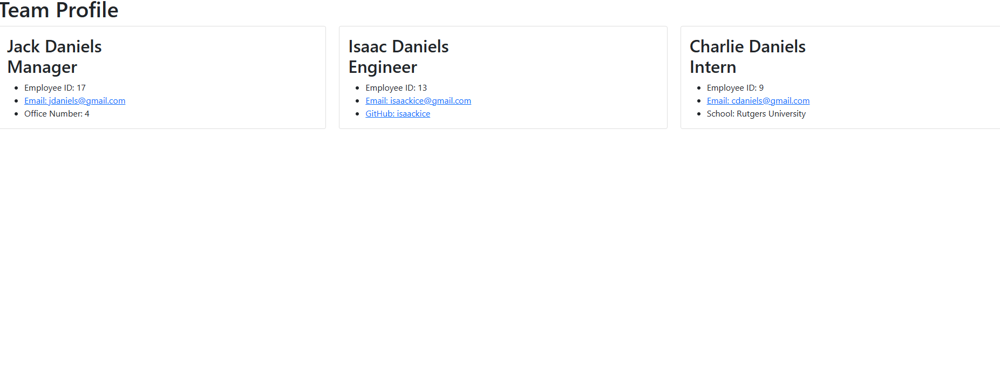

# team-profile-generator-id

## Description

This application allows the user to create a web page displaying work team information including name, position, employee ID number, email, office number, GitHub and/or school.

## Installation

jest version 24.8.0
inquirer version 8.2.4

## Usage

The user must answer the questions in the command-line in the terminal, to run the program you must input 'node index.js'.

Here is a walk-through video:
[Click Here](./assets/images/team-profile-generator.webm)

## Credits

Rutgers Bootcamp, Professor Joe Han, TA Paul Cwik, Classmates Sam Lerner, Azime Nail, and Jonathan Plaras

## License

MIT License ,, Refer to the GitHub repo

## Test

The user can run the test by typing 'npm run test' into the command-line.